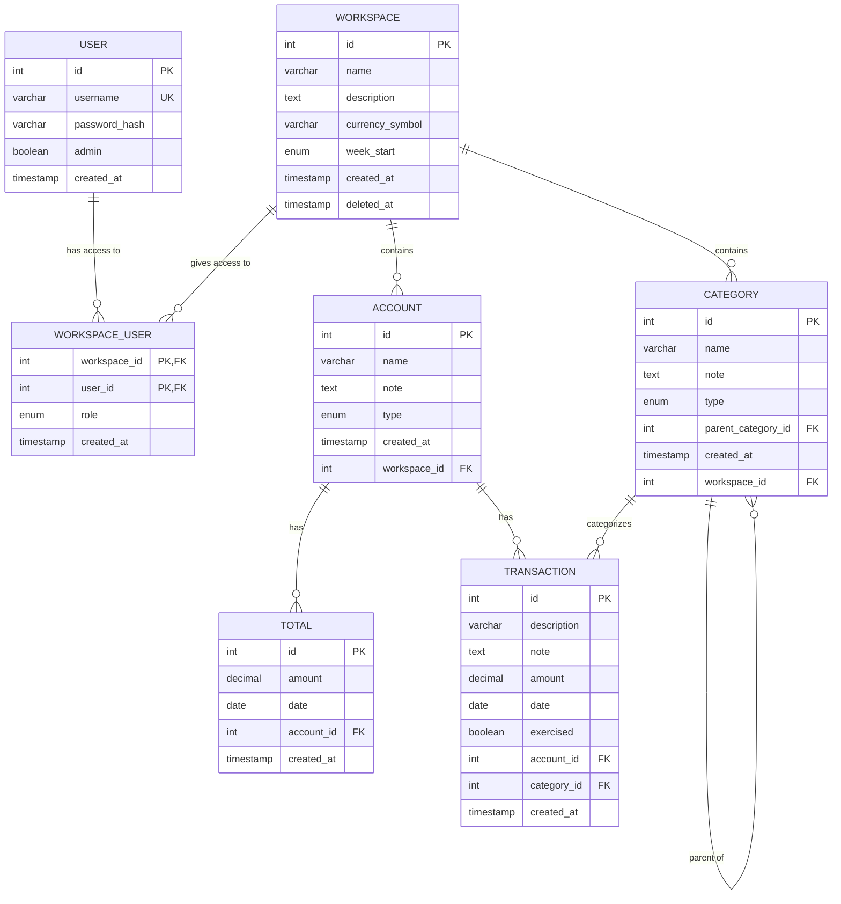

```mermaid
erDiagram
    USER {
        int id PK
        varchar username UK
        varchar password_hash
        boolean admin
        timestamp created_at
    }
    
    WORKSPACE {
        int id PK
        varchar name
        text description
        varchar currency_symbol
        enum week_start
        timestamp created_at
        timestamp deleted_at
    }
    
    WORKSPACE_USER {
        int workspace_id PK,FK
        int user_id PK,FK
        enum role
        timestamp created_at
    }
    
    ACCOUNT {
        int id PK
        varchar name
        text note
        enum type
        timestamp created_at
        int workspace_id FK
    }
    
    TOTAL {
        int id PK
        decimal amount
        date date
        int account_id FK
        timestamp created_at
    }
    
    CATEGORY {
        int id PK
        varchar name
        text note
        enum type
        int parent_category_id FK
        timestamp created_at
        int workspace_id FK
    }
    
    TRANSACTION {
        int id PK
        varchar description
        text note
        decimal amount
        date date
        boolean exercised
        int account_id FK
        int category_id FK
        timestamp created_at
    }
    
    USER ||--o{ WORKSPACE_USER : "has access to"
    WORKSPACE ||--o{ WORKSPACE_USER : "gives access to"
    WORKSPACE ||--o{ ACCOUNT : "contains"
    WORKSPACE ||--o{ CATEGORY : "contains"
    ACCOUNT ||--o{ TRANSACTION : "has"
    ACCOUNT ||--o{ TOTAL : "has"
    CATEGORY ||--o{ TRANSACTION : "categorizes"
    CATEGORY ||--o{ CATEGORY : "parent of"
```
